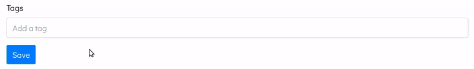
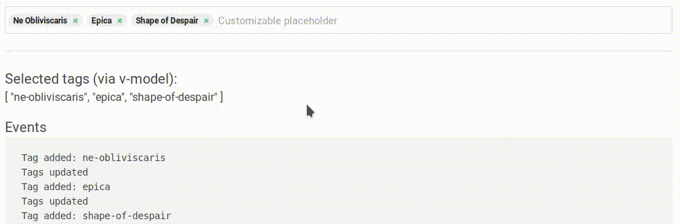

# Voerro Vue Tags Input v2

[](https://www.npmjs.com/package/@voerro/vue-tagsinput)
[](https://www.npmjs.com/package/@voerro/vue-tagsinput)
[](https://opensource.org/licenses/MIT)

A simple tags input with typeahead built with Vue.js 2.




[**Live Demo**](https://voerro.github.io/vue-tagsinput/)

## Installation via NPM

```
npm i @voerro/vue-tagsinput --save-dev
```
or
```
npm i @voerro/vue-tagsinput --save
```

Then register the component with Vue:

```javascript
import VoerroTagsInput from '@voerro/vue-tagsinput';

Vue.component('tags-input', VoerroTagsInput);
```

Include the `dist/style.css` file on your page to apply the styling. You can use CDN, `require()` it inside your JS code, or `@include` it inside your (S)CSS assets. Read the `Styling` section to learn how to customize the appearance.

## Installation via CDN

If you're not using NPM, you can include the required files into your page manually from a CDN. Don't forget to include Vue as well. For example:

```html
<script src="https://cdnjs.cloudflare.com/ajax/libs/vue/2.6.12/vue.min.js"></script>
<script src="https://cdn.jsdelivr.net/npm/@voerro/vue-tagsinput@2.7.0/dist/voerro-vue-tagsinput.js"></script>

<script>
    new Vue({
        el: '#app',
        components: { "tags-input": VoerroTagsInput },
    });
</script>
```

Include the CSS file on your page to apply the styling. Read the `Styling` section to learn how to customize the appearance.

```
<link rel="stylesheet" href="https://cdn.jsdelivr.net/npm/@voerro/vue-tagsinput@2.7.0/dist/style.css">
```

**IMPORTANT:** Always grab the latest versions of the package from [JSDELIVR](https://www.jsdelivr.com/package/npm/@voerro/vue-tagsinput?path=dist), the ones provided in the examples above might be outdated. Same goes for Vue.js.

## Usage

```html
<tags-input element-id="tags"
    v-model="selectedTags"
    :existing-tags="[
        { key: 'web-development', value: 'Web Development' },
        { key: 'php', value: 'PHP' },
        { key: 'javascript', value: 'JavaScript' },
    ]"
    :typeahead="true"></tags-input>
```

```html
<tags-input element-id="tags"
    v-model="selectedTags"
    :existing-tags="[
        { key: 1, value: 'Web Development' },
        { key: 2, value: 'PHP' },
        { key: 3, value: 'JavaScript' },
    ]"
    :typeahead="true"></tags-input>
```

`element-id` will be applied to `id` and `name` attributes of the hidden input that contains the list of the selected tags as its value. Optionally you can also use the `v-model` directive to bind a variable to the array of selected tags.

`existing-tags` is the list of all the existing/valid tags. Include it even if you're not using typeahead.

#### Setting Selected Tags Programmatically

If you need to programmatically (manually) set or change the list of selected tags from "outside" - just set the required value to the variable bound with the component via `v-model`.

For example, the variable name is `selectedTags`:
```html
<tags-input element-id="tags"
    v-model="selectedTags"></tags-input>
```

You can pre-set the value of this variable:
```javascript
new Vue({
    el: '#app',

    components: { VoerroTagsInput },

    data: {
        selectedTags: [
            { key: 'web-development', value: 'Web Development' },
            { key: 'php', value: 'PHP' },
            { key: 'javascript', value: 'JavaScript' },
        ],
    }
});
```

... or change it whenever you need to:
```javascript
new Vue({
    el: '#app',

    components: { VoerroTagsInput },

    data: {
        selectedTags: [],
    },

    methods: {
        setSelectedTags() {
            this.selectedTags = [{ key: 'php', value: 'PHP' }];
        }
    }
});
```

#### Existing And Selected Tags Collections

As you've noticed in the examples above, an item from a tag collection looks like this:

```
{ key: 'web-development', value: 'Web Development' }
```

In reality, you're not limited to what your tag objects should look like. You can name your fields however you want, just don't forget to tell the component the correct field names. To customize the `key` field name, set the `id-field` prop. To customize the `value` field name, set the `text-field` prop. For example:

```html
<tags-input element-id="tags"
    v-model="selectedTags"
    :existing-tags="[
        { id: 1, name: 'Web Development' },
        { id: 2, name: 'PHP' },
        { id: 3, name: 'JavaScript' },
    ]"
    id-field="id"
    text-field="name"></tags-input>
```

Note that the selected tags collection should have the same `id` and `text` field names as the existing tags collection.

Your tag options can also have other (extra) fields, for example when you fetch data from your DB and pass it directly to the component as is. This is perfectly fine and won't create any problems.

#### All Available Props

Prop | Type | Default | Description
--- | --- | --- | ---
element-id | String | - | name for the hidden form input with the value.
input-id | String | - | id & name for the visible input.
disabled | Boolean | false | Disable the element. You won't be able to add new tags and remove the existing ones.
existing-tags | Array | [] | An array with existing tags in the following format: `[{ key: 'id-or-slug-of-the-tag', value: 'Tag\'s text representation' }, {...}, ...]`
id-field | String | 'key' | The name of the "id" field in your existing and selected tags collections. The actual value of each tag.
text-field | String | 'value' | The name of the "text" field in your existing and selected tags collections. This is what you see on the tag badges. Used when searching for a tag (typeahead).
display-field | String | null | The name of the "display" field in your existing and selected tags collections. Overrides your tag's "text" field to display additional data in dropdown lists.
value-fields | String | null | A comma-separated list of fields to be included in the hidden inputs' values. These make up data that will be returned with the form as FormData. `null` means "include all fields".
typeahead | Boolean | false | Whether the typeahead (autocomplete) functionality should be enabled.
typeahead-style | String | 'badges' | The autocomplete prompt style. Possible values: `badges`, `dropdown`.
typeahead-max-results | Number | 0 | Maximum number of typeahead results to be shown. 0 - unlimited.
typeahead-activation-threshold | Number | 1 | Show typeahead results only after at least this many characters were entered. When set to 0, typeahead with all the available tags will be displayed on input focus.
typeahead-always-show | Boolean | false | Always show typeahead, even if not focused or under typeahead-activation-threshold.
typeahead-show-on-focus | Boolean | true | Show typeahead on input field focus.
typeahead-hide-discard | Boolean | false | Hides the 'Discard Search Results' option.
placeholder | String | 'Add a tag' | The placeholder of the tag input.
typeahead-url | String | '' | If the option is set, the URL will be used for AJAX search/typeahead. Use the `:search` wildcard wherever you want the search query to go, for example `http://example.com/tags?search=:search`. The returned data must be in the `existing-tags` format.
typeahead-callback | Function | null | An optional callback to implement custom search/typeahead functionality. Accepts search query as a parameter. For example, this is useful when you want to implement custom AJAX calls with headers and other options. Must return a Promise that resolves with data in the `existing-tags` format.
discard-search-text | String | 'Discard Search Results' | The 'Discard Search Results' button text.
limit | Number | 0 | Limit the number of tags that can be chosen. 0 = no limit.
hide-input-on-limit | Boolean | false | Hide the input field when the tags limit is reached.
only-existing-tags | Boolean | false | Only existing tags can be added/chosen. New tags won't be created.
case-sensitive-tags | Boolean | false | Determines whether tags are case sensitive. Setting this to `true` would allow tags like `php`, `PHP`, `PhP`, and so on to be added at the same time.
delete-on-backspace | Boolean | true | Whether deleting tags by pressing Backspace is allowed.
allow-duplicates | Boolean | false | Allow users to add the same tags multiple times.
validate | Function | `text => true` | Callback to validate tags' text with.
add-tags-on-comma | Boolean | false | Add new tags when comma is pressed. The search (typeahead) results are ignored.
add-tags-on-space | Boolean | false | Add new tags when space is pressed. The search (typeahead) results are ignored.
add-tags-on-blur | Boolean | false | Add new tags when on the input is blur. The search (typeahead) results are ignored.
sort-search-results | Boolean | true | Whether the search results should be sorted.
before-adding-tag | Function | `tag => true` | Callback to perform additional checks and actions before a tag is added. Return `true` to allow a tag to be added or `false` to forbid the action.
before-removing-tag | Function | `tag => true` | Callback to perform additional checks and actions before a tag is removed. Return `true` to allow a tag to be added or `false` to forbid the action.

#### Events

Event | Description
--- | ---
@initialized | Fired when the component is completely ready to be worked with. Fired from the Vue.js' `mounted()` method.
@tag-added | Fired when a new tag is added. The slug of the tag is passed along.
@tag-removed | Fired when a tag is removed. The slug of the tag is passed along.
@tags-updated | Fired when a tag is added or removed.
@limit-reached | Fired when the limit of tags is reached
@keydown | Fires on a keydown event
@keyup | Fires on a keyup event
@focus | Fired when the input is focused
@blur | Fired when the input is blurred
@change | Fired when the input text changes

```html
<voerro-tags-input
    ...
    @initialized="onInitialized"
    @tag-added="onTagAdded"
    @tag-removed="onTagRemoved"
    @tags-updated="onTagsUpdated"
    @limit-reached="onLimitReached"
    @keydown="onKeyDown"
    @keyup="onKeyUp"
    @focus="onFocus"
    @blur="onBlur"
    @change="onChange"
></voerro-tags-input>
```

```javascript
<script>
new Vue({
    ...

    methods: {
        onInitialized() {
            console.log('Initialized');
        },

        onTagAdded(slug) {
            console.log(`Tag added: ${slug}`);
        },

        onTagRemoved(slug) {
            console.log(`Tag removed: ${slug}`);
        },

        onTagsUpdated() {
            console.log('Tags updated');
        },

        onLimitReached() {
            console.log('Max Reached');
        },

        onKeyDown() {
            console.log('Key down');
        },

        onKeyUp() {
            console.log('Key up');
        },

        onFocus() {
            console.log('Input focused');
        },

        onBlur() {
            console.log('Input blurred');
        },

        onChange(value) {
            console.log(`Input changed: ${value}`);
        }
    }
});
</script>
```

## Data

### v-model

You can bind the array of selected tags to a variable via `v-model`. A tag object within the array looks like this:

```
{ key: 'web-development', value: 'Web Development' }
```

`key` is whatever unique key you use for the tags in your project. It could be a unique slug, it could be a unique numeric id, it could be something else. `value` is the text representation of a tag. If you've set custom field names via `id-field` and `text-field` props - use those instead of `key` and `value`.

### Form Data

There's also a hidden text input for each selected tag so that you could easily convert that to FormData. The `name` and `id` of the input equal to whatever you set to the `element-id` prop.

The value of each input equals to a stringified version of a tag object. Note that the tags that don't exist in the `existing-tags` array will have its `key` equal to an empty string `''`. In your backend you can consider these tags as `to be created`.

If you don't need whole tag objects, you can specify which tag fields you want to be returned with the `value-fields` prop. Provide a comma-separated list of fields or a single field name. If you specify a single field, you'll get that field values alone instead of stringified objects.

## Styling

If you want to completely re-style the component - write your own styles from scratch using `dist/style.css` as a reference. Alternatively you can override specific parts of `dist/style.css` using `!important`.

Certain classes/styles can be overridden via component props on a per instance basis in case you just want to make minor changes, e.g. you just want to change colors.

Prop | Default class | Area
--- | --- | ---
wrapper-class | tags-input-wrapper-default | Outer appearance of the input - a wrapper providing a border and padding around the selected tags. If you're using CSS frameworks, you could use the frameworks' native classes, e.g. `form-control` for Bootstrap or `input` for Bulma.

You can also customize selected tags' badges using the `selected-tag` slot, for example like this:

```html
<tags-input ...>
    <template v-slot:selected-tag="{ tag, index, removeTag }">
        <span v-html="tag.value"></span>

        <a v-show="!disabled"
            href="#"
            class="tags-input-remove"
            @click.prevent="removeTag(index)"></a>
    </template>
</tags-input>
```


## Using Typeahead (Autocomplete)

When search results are displayed underneath the input, use the `arrow down` and `arrow up` keys on the keyboard to move the selection. Press `Enter` to select a tag. Press `Esc` to discard the search results and then `Enter` to add a new tag the way you've typed it.

## Breaking Changes

#### v1.0.0 ... v1.5.0 -> v1.5.1

See the `v1` branch for details.

#### v1.5.1 and above -> v2.*

A pretty serious bug ([#53](../../issues/53)) was fixed in `v2.0.0`. The data format for the `existing-tags` prop and the `v-model` directive has been changed. You can find the new format in this documentation, see above.

#### v2.3.0 -> v2.4.0

Multiple hidden fields instead of one, so that your backend treats the selected tags as an array.

## Changelog

#### v.2.4.0

- New options: `id-field` and `text-field`
- **IMPORTANT**: multiple hidden fields instead of one, so that your backend treats the selected tags as an array
- New option: `value-fields`

#### v.2.3.0

- Individual selected tags are now wrapped in a `<slot>`
- Fix: existingTags prop modified directly ([#94](../../issues/94))
- New option: `disabled` (disable the element) ([#92](../../issues/92))

#### v.2.2.0

- New option: `hide-input-on-limit`
- New option: `typeahead-show-on-focus`. It is enabled by default and will make the typeahead (badges or dropdown) visible whenever the input field is focused and if there are any tags suggestions.
- Adding `active` class to the wrapper element when the input field is focused. If you're using the default (provided) `style.css` file, note that your tags input will now get a "glow" around it when focused.
- Fix: [#50](../../issues/50)
- Fix: Incorrect check for duplicate tags
- Added AJAX search with the `typeahead-url` option. Solves [#60](../../issues/60).

#### v.2.1.0

- New option: `typeahead-always-show`
- New option: `typeahead-hide-discard`
- New option: `add-tags-on-space`
- New event: `change`
- "Discard Search Results" string (option text) is now customizable
- Fixed a minor bug with removing tags on backspace press

#### v.2.2.0

- Fix: [#43](../../issues/43)
- Fix: [#62](../../issues/62)

#### v.2.0.1

- Fix: broken dropdown
- Fix: typeahead/autocomplete doesn't show up on Android
- Fix: Add Tags on Comma doesn't work on Android
- Fix: Mobil users cannot press `Esc` to discard search results, so added a "Discard search results" button which seemlessly blends into the typeahead (both badges and dropdown).
- New: `limit-reached` prop

#### v.2.0.0

- The data format for the `existing-tags` prop and the `v-model` directive has been changed

## Contribution

Everyone is welcome to contribute. When making a contribution, please base your branch off of `dev` and merge it into `dev` as well. Thank you!

## Support

This software is absolutely free to use and is developed in the author's free time. If you found this software useful and would like to say thank you to the author, please consider making a donation. It's not the amount, it's the gesture.

- PayPal: https://paypal.me/AlexanderZavyalov
